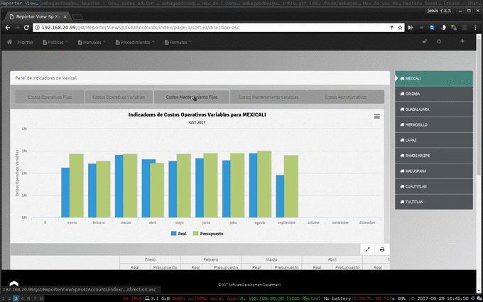
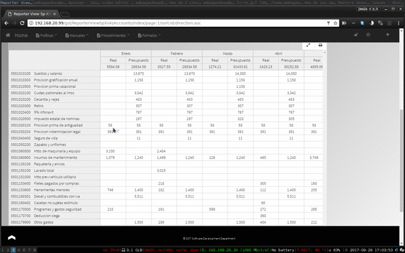

# KML acl_manager
by Ambagasdowa

Login in

### CakePHP version
CakePHP 1.3.20

 - Added support for Jquery and Prototye libraries and the framework Bootstrap
 - Simple Acl controlled Application from http://book.cakephp.org/1.3/en/The-Manual/Tutorials-Examples/Simple-Acl-controlled-Application.html
 - And a Administration plugin from
	https://github.com/sams/alaxos_acl/tree/master

CakePHP is a rapid development framework for PHP which uses commonly known design patterns like Active Record, Association Data Mapping, Front Controller and MVC. Our primary goal is to provide a structured framework that enables PHP users at all levels to rapidly develop robust web applications, without any loss to flexibility.

### TODO of KML acl_manager

Search Engine **done**
ribbon menu   **done**

#### Policy's Module
  **DONE**

#### Projections Module

  **DONE**

#### Finances Module

###### Pretty Print

  **DONE**

* TODO

  > build totalizations

* NOTES

  > build a users-module Manager

Projections [^1]
[^1]: version of projections is 2.1.0

#### Management Reporter Module

**ALLMOST-DONE**

* TODO

> build a users-module Manager

* NOTES

> installation Manual

MR [^2]
[^2]: version of MR is 1.0.0
